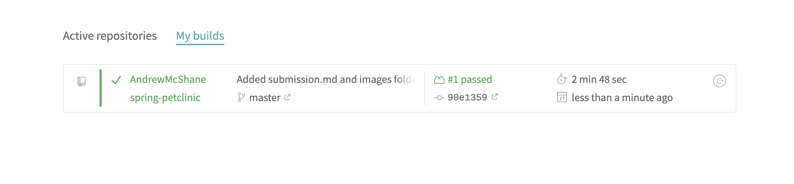
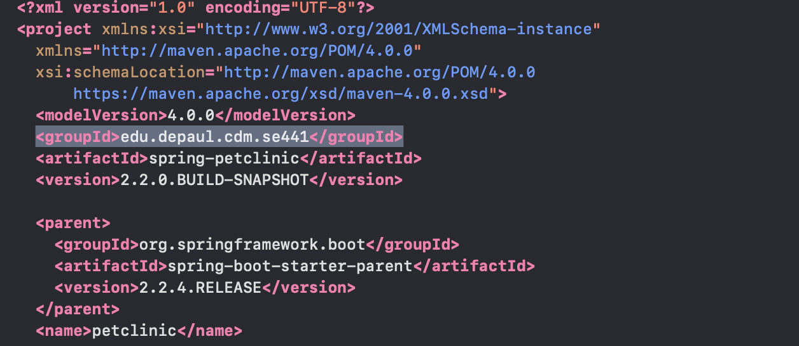
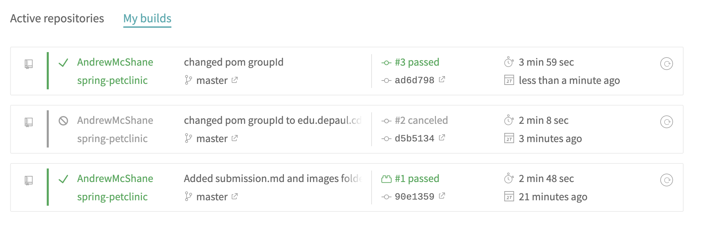
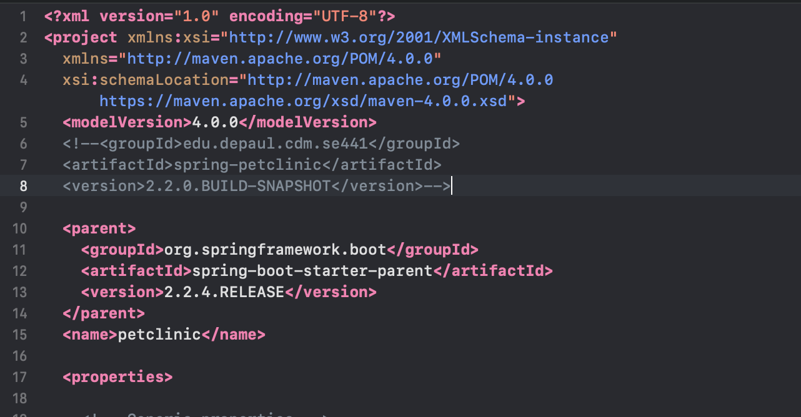
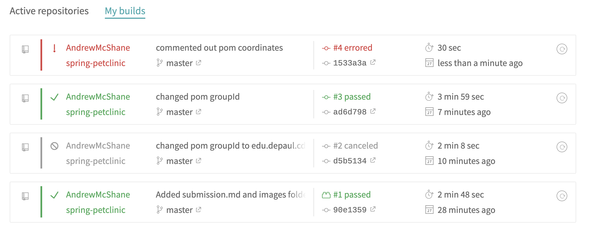
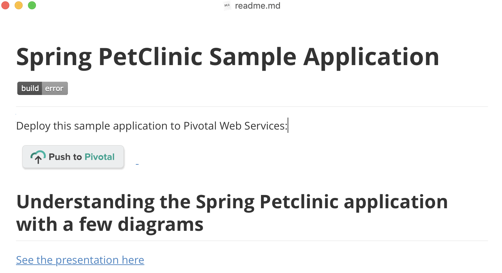
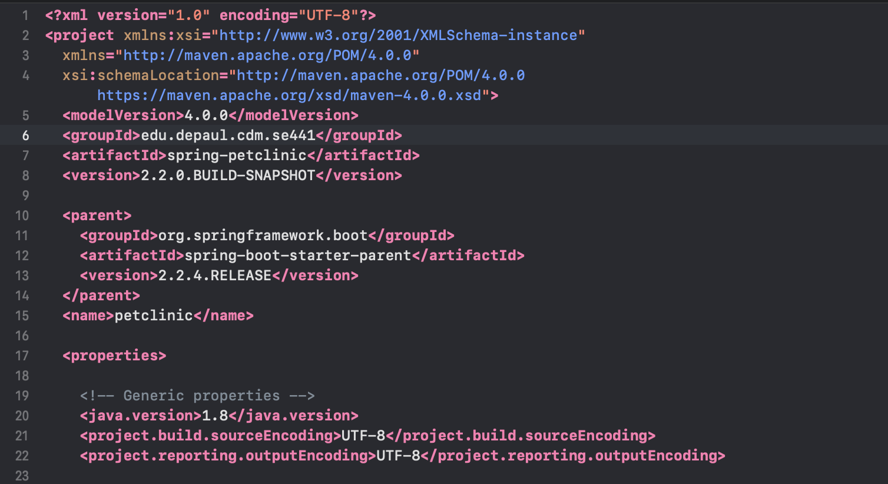
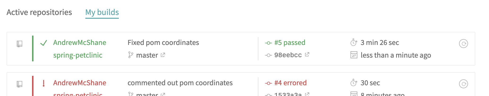
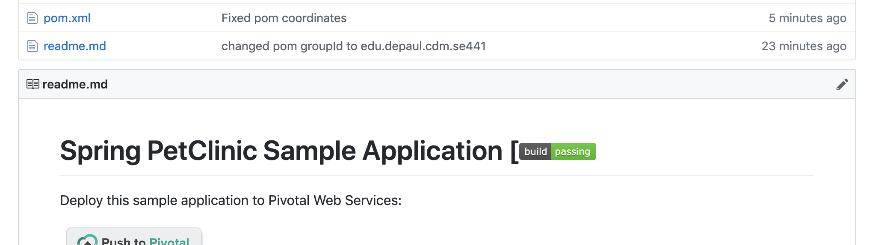

# Hw5

#### SE441

#### Andrew McShane

1. Forked github repo:

   

2. Pet Clinic hosted locally:

   

3. Changed coordinates:

   

4. Build Success after successful change

   

5. Commented out coordinates

6. Build Error

   

7. Error on readme.md:

   

8. Fixed pom.xml

   

9. Passing build with fixed coordinates

10. readme.md with passing build tag

    

